# Tool Learning Log

## Tool: MERN Stack

## Project: Music Playing Web App

---

### 10/5/25:
I have been learning the MERN stack recently in order to help me develop interactive real-time web applications that store user data. (MongoDB, Express, React, Nodejs)

dev.to is a resource for developers and on there I found a blog post with a link to a playlist for a (complete MERN stack tutorial)[https://www.youtube.com/playlist?list=PL63c_Ws9ecIQkH5xD6JW4cf2VporjzSRW] to build a simple to-do-list app. I followed the playlist up until part 16 where he started building the React frontend using Material UI--a library that ships pre-built and designed React components--which I realized wouldn't help me in my actual fundamental learning of React and the combined tools in my tech stack for two reasons:
    a. What reason do I have to use Material UI in any future projects anyway?...
    b. Using Material UI when I'm learning the basics hinders my learning of making components from scratch, which I will definitely need to know how to do anyways whether for this project or later on.

So I moved on from that tutorial to a (more relevant and up-to-date)[https://www.youtube.com/watch?v=pmvEgZC55Cg] MERN stack course using Vite and Tailwind CSS for the frontend, and which also showcased the integration of some advanced features such as email verification and password-reset/account-recovery.

I had finished that tutorial over the summer and have a [website up](https://foss-todolister.onrender.com/login) and running that I had to deploy with render, since a MERN stack app with authentication can't be properly deployed on Vercel despite trying numerous times as Vercel is only built to work with its native NextJS auth. The site itself will still run but the auth features like signing up and logging in won't work on Vercel.

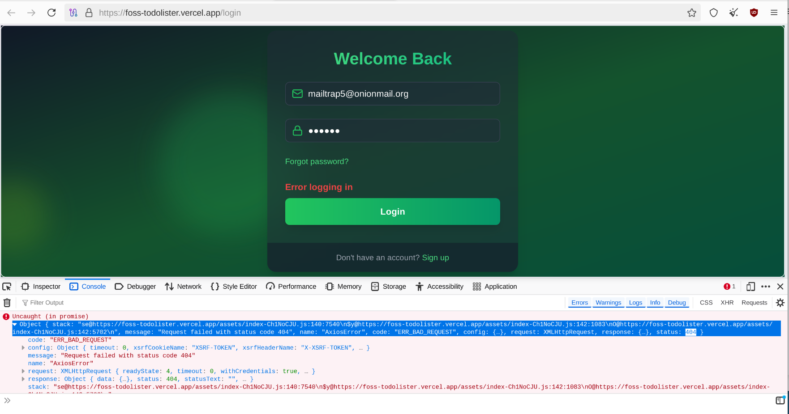

That red error message is thanks to this snippet of React and TailwindCSS code:

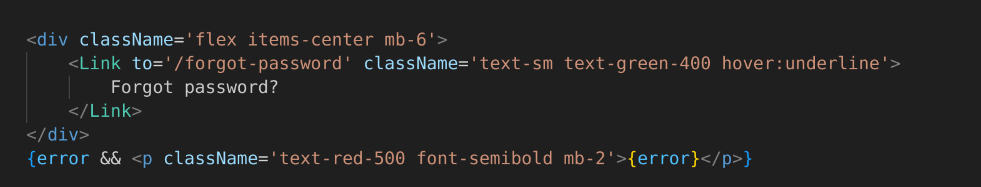

And the message in the console is basically saying that there is an error connecting to the endpoints I have created within the backend of my application, which are fetched to the frontend using Axios within the authStore.js file.

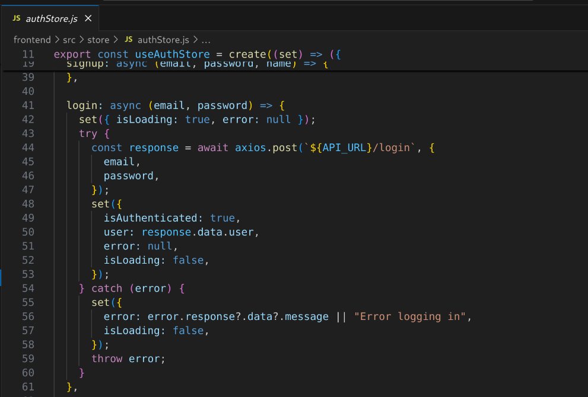

If the login endpoint call worked but the password was wrong then it would show an error saying that the credentials are invalid.

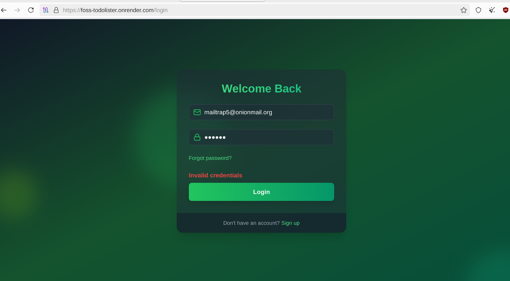

I also integrated the account recovery and email verifification features using mailtrap, but its only free for a limited number of messages to the demo email account that I signed up with.

The dashboard page once you enter after successfully logging in on the working render deployment looks like so:

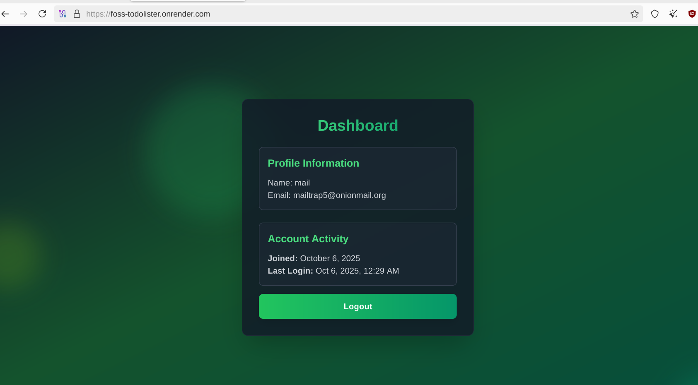

Right now I only have an account-creation and login system created, and I am planning to integrate the CRUD (create, read, update, delete) features for the actual todo list portion of my MERN-practice app, before I move on to building a music app and scrap most of the todo list app code.

I will have all of my code for the todo-lister tinker-mini-project in [this repo](https://github.com/jacobl3371/todolister), and then I will make another repository for my main freedom project music app that I will be working on until the end of the year.


### 4/20/2026

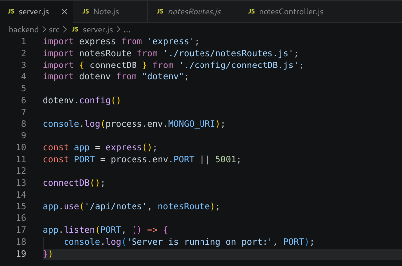

I was missing this line of code to configure `dotenv` 

```js
dotenv.config()
```

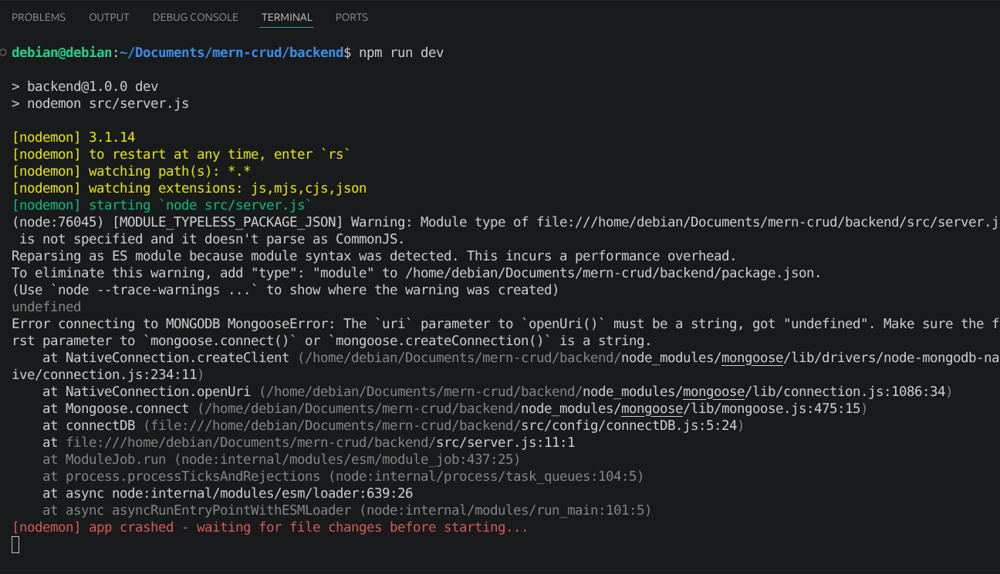

Trying to test the app with `npm run dev` threw an error, as it could not retrieve the MongoDB connection URI that was stored behind an environment variable in the `.env` file.

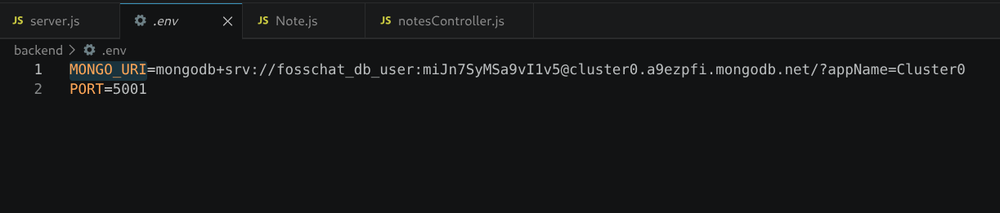

Using the `dotenv` NPM package and `.env` are standard security practices in full stack development to prevent the database from getting leaked through the frontend. Later on I'll have to make sure to label the `.env` file in a `.gitignore` file to ensure that data does not get leaked when I commit on Github.

When I added the `dotenv.config()` method to my `server.js` file and saved with `ctrl + s`, nodemon automatically restarted my application and allowed for the console.log statements to run and show that my server is running.

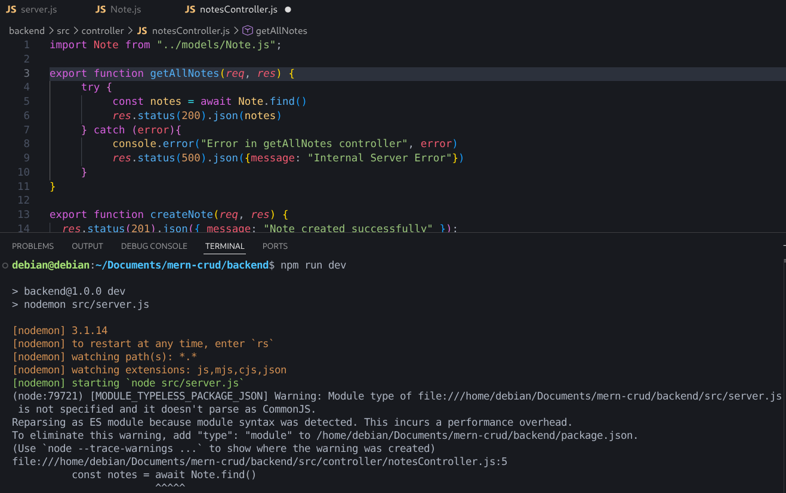

This is also a common error that happens when you forget the `async` keyword before asynchronous functions.


### 4/22/2026

I was using [this url](https://v3.tailwindcss.com/docs/installation) to install TailwindCSS version 3 with the CLI method

I couldn't figure out why this styling wouldn't apply to my button

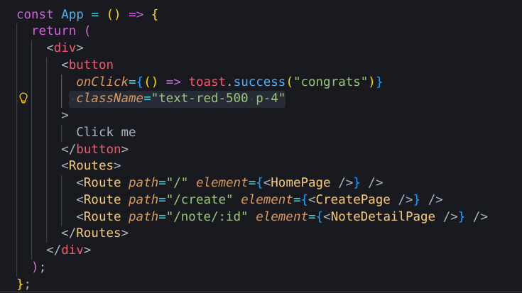

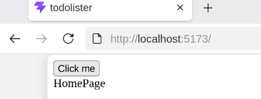

It turns out I needed to use this url [instead](https://v3.tailwindcss.com/docs/guides/vite), for the Vite-specific installation of Tailwind.

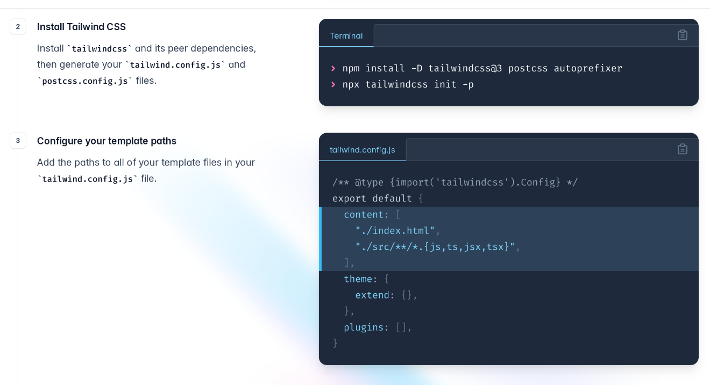

The Vite installation is almost the same as the regular CLI installation method

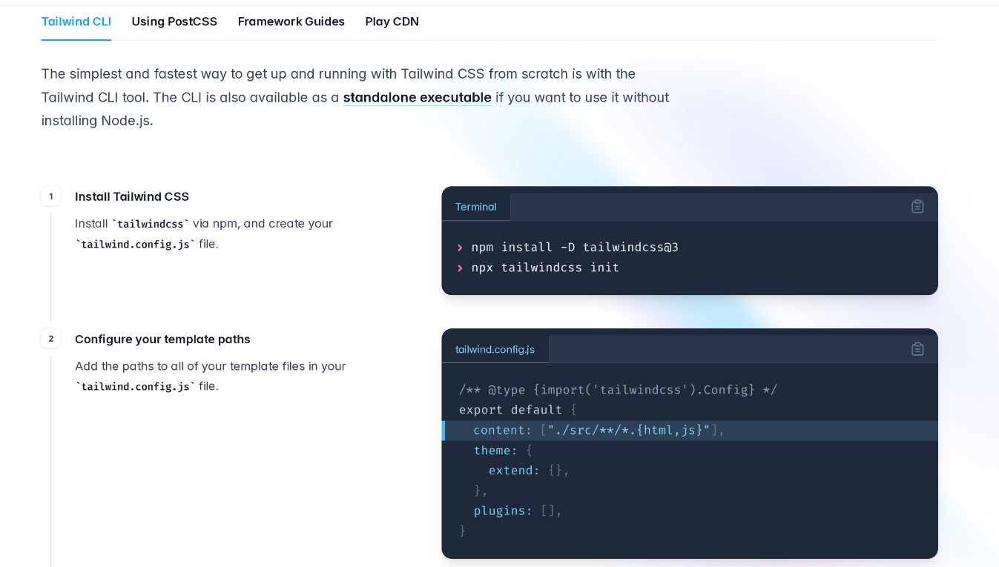

Except that the first command for the Vite-specific installation has that `postcss autoprefixer` line appended to it, and the `tailwind.config.js` `content` looks like this in the regular CLI installation:

```js
 content: ["./src/**/*.{html,js}"],
```

And like so for the Vite-React installation:

```js
 content: [
    "./index.html",
    "./src/**/*.{js,ts,jsx,tsx}",
 ],
```

This makes all the difference in whether the class-styling functionality is able to be applied to the application or not.

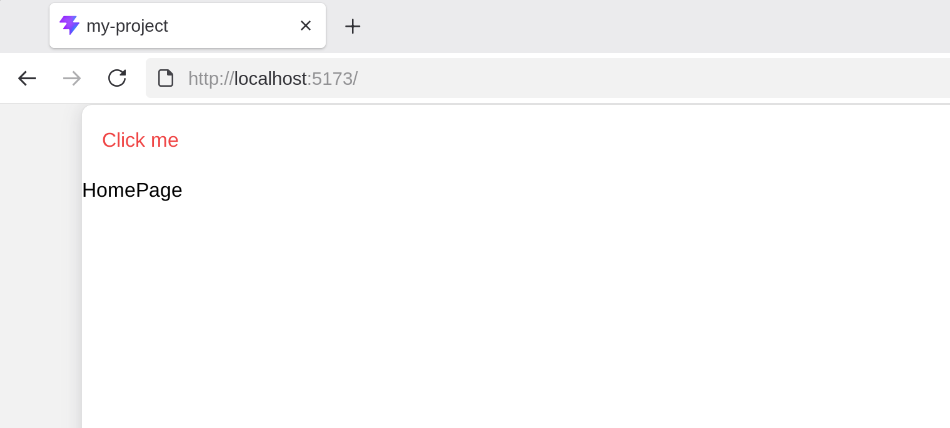
